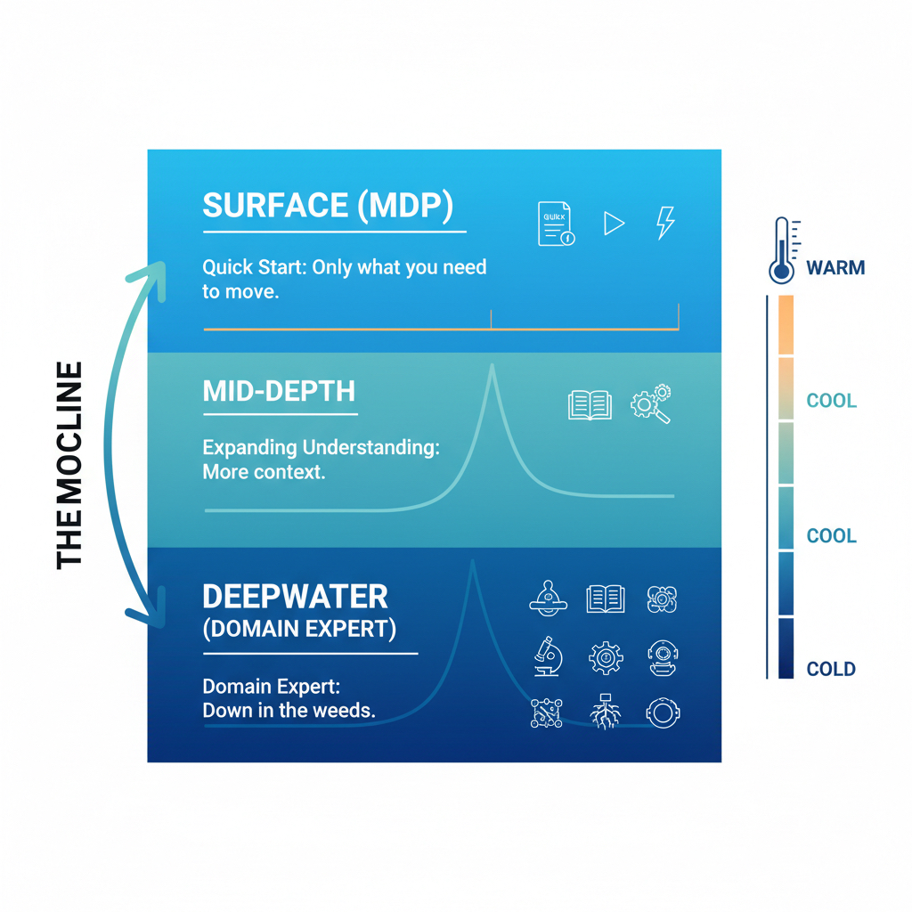

# How to Build an App: A Non-Linear Guide to Software Development

## What This Is

A practical reference for building software that actually works—not just technically, but for the humans who use it and maintain it.

Mortimer J. Adler wrote about reading at different levels in *How to Read a Book*—elementary, inspectional, analytical, syntopical. Same idea here. You can skim the surface of every topic or go deep on the ones that matter to your project. The difference is we're explicit about the layers instead of making you figure it out.

Unlike traditional tutorials that force you through Chapter 1 before Chapter 2, this guide is built for how developers actually work: jumping in wherever you are, getting what you need, and moving forward.

## Who This Is For

**New developers** who need a map of the entire software development lifecycle without drowning in theory.

**Busy developers** who need quick answers right now—not a 300-page book they'll never finish.

**Specialists expanding out** (e.g., backend devs learning deployment, web devs learning ML) who know the process but need domain-specific guidance.

**Generalists leveling up** who want to fill gaps across the full stack of disciplines.

**YOLO devs at 2am** who built something that works and now need to figure out testing, security, or deployment without starting over.

## How This Works: The Thermocline Principle

Each section is organized in layers, like ocean depth:

  
   
  <em>Image generated with Google Gemini</em>

**Surface Layer** - Essential information everyone needs. If you only read this, you won't sink.
- What this step is and why it matters
- Minimum viable version (what you MUST do today)
- Red flags (what happens if you skip this)
- Quick examples

**Mid-Depth** - Practical guidance for competent practitioners.
- Common pitfalls and how to avoid them
- Tool recommendations with reasoning
- Team coordination aspects
- Real-world trade-offs

**Deep Water** - Advanced topics for specialists and mature teams.
- Edge cases and complex scenarios
- Compliance and regulatory considerations
- Enterprise patterns
- Integration with other disciplines

**Read as deep as you need, then surface.** Don't force yourself into deep water when you just need to stay afloat.

## The Philosophy

### 1. Find the Work to Be Done
We start with Jobs-to-be-Done thinking because **building the wrong thing perfectly is still failure**. Before you write a single line of code, understand what problem you're actually solving—not what solution you think you should build.

### 2. Your Product Is Not the Solution
The solution might be a different app, a spreadsheet, a process change, or doing nothing. If you can't articulate the problem without mentioning your product, you haven't found the real job yet.

### 3. Non-Linear by Design
You don't need to read this cover-to-cover. Each section is self-contained enough to be useful on its own:
- Have an idea but don't know where to start? → Begin at [Spot the Job to Be Done](content/01-discovery-planning/job-to-be-done/surface/index.md)
- Already building but getting security warnings? → Jump to [Threat Modeling](content/01-discovery-planning/threat-modeling/surface/index.md) or [Security Testing](content/04-testing/security-testing/surface/index.md)
- Code works but keeps breaking in production? → Go to [Monitoring & Logging](content/06-operations/monitoring-logging/surface/index.md)
- Familiar with web apps but new to ML? → Use the same workflow, different examples

### 4. Thermoclines Prevent Drowning
Most guides are all-or-nothing: either trivial "Hello World" tutorials or enterprise architecture tomes. We give you escape hatches. Read the surface layer, ship your MVP, come back later for mid-depth when you're ready.

**The YOLO dev doesn't need to know about DREAD scoring for threat modeling.** They need to know: "List 3 things an attacker could do to your system and how to prevent them."

**The senior engineer switching to ML doesn't need to re-learn git.** They need: "Here's how data versioning differs from code versioning."

## What's Covered

Each topic below is available at three depth levels. Start with Surface, then dive deeper as needed:

### [Discovery & Planning](content/01-discovery-planning/index.md)
Understand what you're building and why before writing code.
- Spot the Job to Be Done → [Surface](content/01-discovery-planning/job-to-be-done/surface/index.md) | [Mid-Depth](content/01-discovery-planning/job-to-be-done/mid-depth/index.md) | [Deep Water](content/01-discovery-planning/job-to-be-done/deep-water/index.md)
- Concept of Operations → [Surface](content/01-discovery-planning/concept-of-operations/surface/index.md) | [Mid-Depth](content/01-discovery-planning/concept-of-operations/mid-depth/index.md) | [Deep Water](content/01-discovery-planning/concept-of-operations/deep-water/index.md)
- Threat Modeling → [Surface](content/01-discovery-planning/threat-modeling/surface/index.md) | [Mid-Depth](content/01-discovery-planning/threat-modeling/mid-depth/index.md) | [Deep Water](content/01-discovery-planning/threat-modeling/deep-water/index.md)
- Requirements Gathering → [Surface](content/01-discovery-planning/requirements-gathering/surface/index.md) | [Mid-Depth](content/01-discovery-planning/requirements-gathering/mid-depth/index.md) | [Deep Water](content/01-discovery-planning/requirements-gathering/deep-water/index.md)
- Resource Identification → [Surface](content/01-discovery-planning/resource-identification/surface/index.md) | [Mid-Depth](content/01-discovery-planning/resource-identification/mid-depth/index.md) | [Deep Water](content/01-discovery-planning/resource-identification/deep-water/index.md)
- Scope Setting → [Surface](content/01-discovery-planning/scope-setting/surface/index.md) | [Mid-Depth](content/01-discovery-planning/scope-setting/mid-depth/index.md) | [Deep Water](content/01-discovery-planning/scope-setting/deep-water/index.md)

### [Design](content/02-design/index.md)
Plan the architecture and identify risks before implementation.
- Architecture Design → [Surface](content/02-design/architecture-design/surface/index.md) | [Mid-Depth](content/02-design/architecture-design/mid-depth/index.md) | [Deep Water](content/02-design/architecture-design/deep-water/index.md)
- Data Flow Mapping → [Surface](content/02-design/data-flow-mapping/surface/index.md) | [Mid-Depth](content/02-design/data-flow-mapping/mid-depth/index.md) | [Deep Water](content/02-design/data-flow-mapping/deep-water/index.md)
- Software Design Document → [Surface](content/02-design/software-design-document/surface/index.md) | [Mid-Depth](content/02-design/software-design-document/mid-depth/index.md) | [Deep Water](content/02-design/software-design-document/deep-water/index.md)
- Dependency Review → [Surface](content/02-design/dependency-review/surface/index.md) | [Mid-Depth](content/02-design/dependency-review/mid-depth/index.md) | [Deep Water](content/02-design/dependency-review/deep-water/index.md)
- API Design → [Surface](content/02-design/api-design/surface/index.md) | [Mid-Depth](content/02-design/api-design/mid-depth/index.md) | [Deep Water](content/02-design/api-design/deep-water/index.md)
- Database Design → [Surface](content/02-design/database-design/surface/index.md) | [Mid-Depth](content/02-design/database-design/mid-depth/index.md) | [Deep Water](content/02-design/database-design/deep-water/index.md)
- State Management Design → [Surface](content/02-design/state-management-design/surface/index.md) | [Mid-Depth](content/02-design/state-management-design/mid-depth/index.md) | [Deep Water](content/02-design/state-management-design/deep-water/index.md)
- Error Handling & Resilience → [Surface](content/02-design/error-handling-resilience/surface/index.md) | [Mid-Depth](content/02-design/error-handling-resilience/mid-depth/index.md) | [Deep Water](content/02-design/error-handling-resilience/deep-water/index.md)
- Performance & Scalability Design → [Surface](content/02-design/performance-scalability-design/surface/index.md) | [Mid-Depth](content/02-design/performance-scalability-design/mid-depth/index.md) | [Deep Water](content/02-design/performance-scalability-design/deep-water/index.md)

### [Development](content/03-development/index.md)
Write code that works, is secure, and others can maintain.
- Code Quality → [Surface](content/03-development/code-quality/surface/index.md) | [Mid-Depth](content/03-development/code-quality/mid-depth/index.md) | [Deep Water](content/03-development/code-quality/deep-water/index.md)
- Refactoring → [Surface](content/03-development/refactoring/surface/index.md) | [Mid-Depth](content/03-development/refactoring/mid-depth/index.md) | [Deep Water](content/03-development/refactoring/deep-water/index.md)
- Code Review Process → [Surface](content/03-development/code-review-process/surface/index.md) | [Mid-Depth](content/03-development/code-review-process/mid-depth/index.md) | [Deep Water](content/03-development/code-review-process/deep-water/index.md)
- Secret Management → [Surface](content/03-development/secret-management/surface/index.md) | [Mid-Depth](content/03-development/secret-management/mid-depth/index.md) | [Deep Water](content/03-development/secret-management/deep-water/index.md)
- Secure Coding Practices → [Surface](content/03-development/secure-coding-practices/surface/index.md) | [Mid-Depth](content/03-development/secure-coding-practices/mid-depth/index.md) | [Deep Water](content/03-development/secure-coding-practices/deep-water/index.md)
- Supply Chain Security → [Surface](content/03-development/supply-chain-security/surface/index.md) | [Mid-Depth](content/03-development/supply-chain-security/mid-depth/index.md) | [Deep Water](content/03-development/supply-chain-security/deep-water/index.md)

### [Testing](content/04-testing/index.md)
Verify it works, is accessible, and won't break or get hacked.
- Unit & Integration Testing → [Surface](content/04-testing/unit-integration-testing/surface/index.md) | [Mid-Depth](content/04-testing/unit-integration-testing/mid-depth/index.md) | [Deep Water](content/04-testing/unit-integration-testing/deep-water/index.md)
- Security Testing → [Surface](content/04-testing/security-testing/surface/index.md) | [Mid-Depth](content/04-testing/security-testing/mid-depth/index.md) | [Deep Water](content/04-testing/security-testing/deep-water/index.md)
- Accessibility Testing → [Surface](content/04-testing/accessibility-testing/surface/index.md) | [Mid-Depth](content/04-testing/accessibility-testing/mid-depth/index.md) | [Deep Water](content/04-testing/accessibility-testing/deep-water/index.md)
- Compliance Validation → [Surface](content/04-testing/compliance-validation/surface/index.md) | [Mid-Depth](content/04-testing/compliance-validation/mid-depth/index.md) | [Deep Water](content/04-testing/compliance-validation/deep-water/index.md)

### [Deployment](content/05-deployment/index.md)
Get your code running reliably in production.
- Infrastructure as Code → [Surface](content/05-deployment/infrastructure-as-code/surface/index.md) | [Mid-Depth](content/05-deployment/infrastructure-as-code/mid-depth/index.md) | [Deep Water](content/05-deployment/infrastructure-as-code/deep-water/index.md)
- CI/CD Pipeline Security → [Surface](content/05-deployment/cicd-pipeline-security/surface/index.md) | [Mid-Depth](content/05-deployment/cicd-pipeline-security/mid-depth/index.md) | [Deep Water](content/05-deployment/cicd-pipeline-security/deep-water/index.md)
- Deployment Strategy → [Surface](content/05-deployment/deployment-strategy/surface/index.md) | [Mid-Depth](content/05-deployment/deployment-strategy/mid-depth/index.md) | [Deep Water](content/05-deployment/deployment-strategy/deep-water/index.md)
- Access Control → [Surface](content/05-deployment/access-control/surface/index.md) | [Mid-Depth](content/05-deployment/access-control/mid-depth/index.md) | [Deep Water](content/05-deployment/access-control/deep-water/index.md)

### [Operations](content/06-operations/index.md)
Keep it running and handle when things go wrong.
- Monitoring & Logging → [Surface](content/06-operations/monitoring-logging/surface/index.md) | [Mid-Depth](content/06-operations/monitoring-logging/mid-depth/index.md) | [Deep Water](content/06-operations/monitoring-logging/deep-water/index.md)
- Incident Response → [Surface](content/06-operations/incident-response/surface/index.md) | [Mid-Depth](content/06-operations/incident-response/mid-depth/index.md) | [Deep Water](content/06-operations/incident-response/deep-water/index.md)
- Patch Management → [Surface](content/06-operations/patch-management/surface/index.md) | [Mid-Depth](content/06-operations/patch-management/mid-depth/index.md) | [Deep Water](content/06-operations/patch-management/deep-water/index.md)
- Backup & Recovery → [Surface](content/06-operations/backup-recovery/surface/index.md) | [Mid-Depth](content/06-operations/backup-recovery/mid-depth/index.md) | [Deep Water](content/06-operations/backup-recovery/deep-water/index.md)

### [Iteration](content/07-iteration/index.md)
Learn from what happened and improve.
- Retrospectives → [Surface](content/07-iteration/retrospectives/surface/index.md) | [Mid-Depth](content/07-iteration/retrospectives/mid-depth/index.md) | [Deep Water](content/07-iteration/retrospectives/deep-water/index.md)
- Security Posture Reviews → [Surface](content/07-iteration/security-posture-reviews/surface/index.md) | [Mid-Depth](content/07-iteration/security-posture-reviews/mid-depth/index.md) | [Deep Water](content/07-iteration/security-posture-reviews/deep-water/index.md)
- Feature Planning → [Surface](content/07-iteration/feature-planning/surface/index.md) | [Mid-Depth](content/07-iteration/feature-planning/mid-depth/index.md) | [Deep Water](content/07-iteration/feature-planning/deep-water/index.md)

## DevSecOps Integrated Throughout

Security isn't bolted on at the end. Every section integrates security, operations, and development practices because that's how modern software is actually built.

Threat modeling comes early (in Planning), not as an afterthought. Deployment strategy includes rollback procedures. Testing includes security scanning. This reflects reality.

## What This Isn't

**Not a code tutorial.** We won't teach you Python syntax or React hooks. We teach you the process of building systems.

**Not prescriptive.** We show trade-offs, not dogma. "Always use microservices" is bullshit. "Here's when microservices help and when they hurt" is useful.

**Not comprehensive.** We prioritize the 20% of knowledge that prevents 80% of pain. If you need the remaining 80% of knowledge, we'll point you to domain-specific resources.

**Not linear.** You're not required to read in order. Jump around. Skip sections. Come back later.

## How to Use This Guide

1. **Identify where you are** in the development lifecycle
2. **Jump to that section** (you don't need permission to skip ahead)
3. **Read the surface layer** to get oriented
4. **Dive deeper if needed** based on your project's maturity
5. **Return later** when you hit new challenges

## A Note on Maturity

Early projects need surface-level guidance. "Just get it working" is a legitimate strategy for validating an idea.

As your project grows—more users, more revenue, more risk—you'll naturally need mid-depth and deep-water practices. Compliance requirements, security audits, and scaling challenges will pull you deeper.

**That's fine.** Build for where you are now, not where you might be someday. Come back when the pain points emerge.

## Additional Resources

**[References](references.md)** - Complete bibliography of all books, research papers, industry case studies, standards, and tools referenced throughout this guide. Organized by category for easy lookup.

## Contributing

This guide is open-source and evolves based on real-world feedback. If you found a section unclear, a strategy that backfired, or a gap we missed—contribute.

We're especially interested in:
- Real examples of what went wrong (and right)
- Domain-specific variations (healthcare, finance, gaming, etc.)
- Trade-offs we missed
- Simpler ways to explain complex topics

## Start Here

Not sure where to begin? Ask yourself:

- **Do I have a clear problem statement?** → Start with [Spot the Job to Be Done](content/01-discovery-planning/job-to-be-done/surface/index.md)
- **Do I know what I'm building but not how?** → Jump to [Design](content/02-design/index.md)
- **Do I have code but it's a mess?** → Visit [Development](content/03-development/index.md) practices
- **Does it work but keeps breaking?** → Head to [Testing](content/04-testing/index.md) or [Operations](content/06-operations/index.md)
- **Am I repeating the same mistakes?** → Check [Iteration](content/07-iteration/index.md)

**Remember:** You don't need to read everything. Read what you need, when you need it. The rest will be here when you're ready.

---

*"People don't want a quarter-inch drill, they want a quarter-inch hole."* - Theodore Levitt

Now go find out what hole your users actually need.