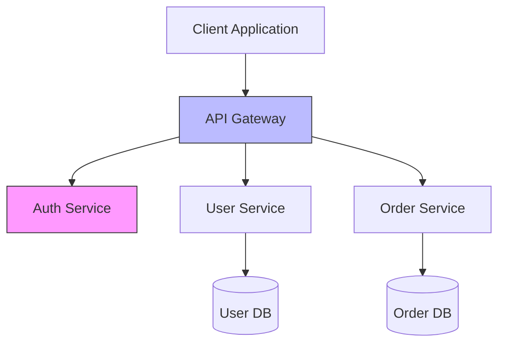

# Assets Directory

This directory contains all media assets used throughout the learning content: diagrams, images, videos, and interactive visualizations.

## Purpose

Visual assets enhance learning by:

1. **Illustrating complex concepts** that are hard to explain with text alone
2. **Providing mental models** for system architecture and data flow
3. **Showing real examples** through screenshots and recordings
4. **Engaging different learning styles** beyond text-based content

## Directory Structure

```
assets/
├── diagrams/                  # Technical diagrams and flowcharts
│   ├── architecture/          # System architecture diagrams
│   ├── data-flow/             # Data flow and sequence diagrams
│   ├── threat-models/         # Threat modeling diagrams
│   ├── deployment/            # Infrastructure and deployment diagrams
│   └── workflows/             # Process and workflow diagrams
├── images/                    # Static images
│   ├── screenshots/           # Tool screenshots and UI examples
│   ├── illustrations/         # Concept illustrations
│   └── icons/                 # Icon set for the app
└── videos/                    # Video content
    ├── screencasts/           # Screen recordings of tools/processes
    └── tutorials/             # Explanatory video tutorials
```

## Diagrams

All diagrams are stored in multiple formats for flexibility:

### Source Format
- **Preferred**: Mermaid.js (text-based, version-controllable)
- **Alternative**: Draw.io XML, PlantUML, or Excalidraw JSON
- **Benefit**: Can be edited, diff'd in Git, regenerated

### Export Formats
- **SVG**: Scalable, preferred for web
- **PNG**: Fallback for compatibility
- **PDF**: High-quality print version

### Directory Structure

```
diagrams/architecture/
├── microservices-example/
│   ├── diagram.mmd            # Mermaid source
│   ├── diagram.svg            # SVG export
│   ├── diagram.png            # PNG export
│   ├── diagram.pdf            # PDF export
│   └── README.md              # Diagram explanation
└── monolith-example/
    └── [same structure]
```

### Example: Mermaid Diagram

**File**: `diagrams/architecture/microservices-example/diagram.mmd`



**File**: `diagrams/architecture/microservices-example/README.md`

```markdown
# Microservices Architecture Example

## Overview
This diagram illustrates a basic microservices architecture with:
- API Gateway for routing
- Independent services (Auth, Users, Orders)
- Separate databases per service

## Key Concepts
- **API Gateway**: Single entry point, handles routing and cross-cutting concerns
- **Service Independence**: Each service can be deployed independently
- **Database per Service**: Data isolation, each service owns its data

## When to Use
- Multiple teams working on different features
- Need to scale services independently
- Different services have different technology requirements

## Trade-offs
- **Pros**: Scalability, independence, technology flexibility
- **Cons**: Complexity, distributed system challenges, data consistency

## Related Topics
- [Architecture Design](/content/02-design/architecture-design/)
- [Dependency Review](/content/02-design/dependency-review/)
- [Deployment Strategy](/content/05-deployment/deployment-strategy/)

## Used In
- Architecture Design (mid-depth)
- Deployment Strategy (mid-depth)
- Monitoring & Logging (deep-water)
```

## Diagram Types

### Architecture Diagrams
Show system structure and component relationships:
- **C4 Model**: Context, Container, Component, Code
- **Deployment**: Infrastructure and deployment topology
- **Network**: Network topology and security zones

**Example topics**:
- Monolithic vs. Microservices
- Three-tier architecture
- Serverless architecture
- Edge computing patterns

### Data Flow Diagrams
Show how data moves through the system:
- **Sequence diagrams**: Interaction over time
- **Data flow diagrams**: Data transformation and movement
- **State machines**: State transitions

**Example topics**:
- Request/response flow
- Authentication flow
- Payment processing flow
- Data pipeline ETL

### Threat Model Diagrams
Visualize security threats and attack surfaces:
- **Attack trees**: Hierarchical threat breakdown
- **Data flow with trust boundaries**: Where data crosses security zones
- **Attack surface maps**: Entry points for attackers

**Example topics**:
- STRIDE threat examples
- Common attack patterns
- Defense-in-depth layers

### Deployment Diagrams
Show infrastructure and deployment configurations:
- **Infrastructure topology**: Servers, networks, load balancers
- **Deployment strategies**: Blue/green, canary, rolling
- **Container orchestration**: Kubernetes, Docker Swarm

**Example topics**:
- CI/CD pipeline
- Multi-region deployment
- Auto-scaling configuration

### Workflow Diagrams
Show processes and decision flows:
- **Flowcharts**: Process steps and decisions
- **Swimlane diagrams**: Responsibilities across roles
- **BPMN**: Business process modeling

**Example topics**:
- Code review process
- Incident response workflow
- Feature development lifecycle

## Images

### Screenshots
Capture real tool interfaces and examples:

**Naming convention**: `{tool-name}_{feature}_{description}.png`

Examples:
- `github_pull-request_review-comments.png`
- `datadog_dashboard_api-monitoring.png`
- `vscode_debugger_breakpoint-inspection.png`

**Guidelines**:
- **Resolution**: Minimum 1920x1080 for screencasts, can be smaller for UI snippets
- **Format**: PNG for UI screenshots (lossless)
- **Annotations**: Add arrows, highlights, callouts to guide attention
- **Privacy**: Redact sensitive information (API keys, personal data)
- **Accessibility**: Include descriptive alt text in metadata

### Illustrations
Custom illustrations for abstract concepts:

**Examples**:
- Thermocline depth visualization
- Security layers (defense-in-depth)
- CI/CD pipeline stages
- The software development lifecycle

**Format**: SVG preferred (scalable, small file size)

**Style guide**:
- Consistent color palette (defined in `/assets/style-guide.md`)
- Simple, clear, not overly detailed
- Accessible color contrast
- Works in both light and dark mode

### Icons
UI icons for the interactive app:

```
icons/
├── phases/                    # Icons for 7 phases
│   ├── discovery.svg
│   ├── design.svg
│   ├── development.svg
│   ├── testing.svg
│   ├── deployment.svg
│   ├── operations.svg
│   └── iteration.svg
├── depth-levels/              # Thermocline depth indicators
│   ├── surface.svg
│   ├── mid-depth.svg
│   └── deep-water.svg
├── personas/                  # User persona icons
│   ├── new-developer.svg
│   ├── yolo-dev.svg
│   ├── specialist.svg
│   ├── generalist.svg
│   └── busy-developer.svg
└── ui/                        # General UI icons
    ├── checkmark.svg
    ├── warning.svg
    ├── info.svg
    └── external-link.svg
```

**Format**: SVG, single color (recolorable via CSS)

## Videos

### Screencasts
Short (2-5 minute) screen recordings demonstrating:
- Tool usage
- Configuration walkthroughs
- Debugging techniques
- Deployment processes

**Format**: MP4 (H.264 codec), 1080p, 30fps

**Guidelines**:
- Keep focused on single topic
- Include audio narration
- Add captions for accessibility
- Show keyboard shortcuts prominently
- Provide written transcript

### Tutorials
Longer-form video explanations (5-15 minutes):
- Concept explanations
- Case study walkthroughs
- Interview/discussion format

**Format**: MP4 (H.264 codec), 1080p, 30fps

**Guidelines**:
- Script and rehearse
- Professional audio quality
- B-roll for visual interest
- Chapter markers for navigation
- Provide written summary

## Asset Metadata

Each asset should have accompanying metadata:

**Format**: `{asset-name}.meta.json`

```json
{
  "title": "Microservices Architecture Example",
  "description": "Diagram showing basic microservices with API gateway and separate databases",
  "type": "diagram",
  "category": "architecture",
  "format": "mermaid",
  "exports": ["svg", "png", "pdf"],
  "alt_text": "Architecture diagram showing client connecting to API gateway, which routes to auth, user, and order services, each with their own database",
  "topics": [
    "architecture-design",
    "deployment-strategy",
    "monitoring-logging"
  ],
  "depth_levels": ["mid-depth", "deep-water"],
  "tags": ["microservices", "architecture", "api-gateway"],
  "license": "CC-BY-4.0",
  "created": "2025-11-15",
  "updated": "2025-11-15",
  "author": "Author Name",
  "accessibility": {
    "alt_text": "Detailed alt text for screen readers",
    "long_description": "Extended description for complex diagrams",
    "color_blind_safe": true
  }
}
```

## Accessibility Requirements

All visual assets must be accessible:

1. **Alt Text**: Descriptive text for screen readers
2. **Long Descriptions**: Extended descriptions for complex diagrams
3. **Color**: Don't rely on color alone (use patterns, labels)
4. **Contrast**: WCAG AA minimum (4.5:1 for text)
5. **Text in Images**: Avoid text in images; use SVG text elements or captions
6. **Transcripts**: For all video content
7. **Captions**: For all videos with audio

## File Naming Conventions

- **Lowercase**: All filenames lowercase
- **Hyphens**: Use hyphens, not underscores or spaces
- **Descriptive**: `threat-model-stride-example.svg` not `diagram1.svg`
- **Versioned**: If multiple versions, append version: `architecture-v2.svg`

## File Size Guidelines

Keep assets optimized for web delivery:

- **SVG**: Optimize with SVGO, remove unnecessary metadata
- **PNG**: Compress with pngcrush or similar
- **JPEG**: Quality 85%, progressive encoding
- **Video**: H.264, CRF 23, 1080p max for web

**Maximum file sizes**:
- Diagrams (SVG): 200KB
- Images (PNG): 500KB
- Screenshots (PNG): 1MB
- Videos (MP4): 50MB

Use CDN for larger assets in production.

## Responsive Images

Provide multiple resolutions for images:

```
screenshot-example/
├── screenshot-example.png          # Original (1920x1080)
├── screenshot-example-1024.png     # Medium (1024x576)
├── screenshot-example-640.png      # Small (640x360)
└── screenshot-example.meta.json    # Metadata
```

App can serve appropriate size based on viewport.

## Integration with Content

### Markdown Embedding

```markdown
## Architecture Patterns

Here's a typical microservices architecture:


**Figure 1**: Microservices architecture with API gateway pattern.
[View full description](/assets/diagrams/architecture/microservices-example/README.md)

For comparison, here's a monolithic architecture:


```

### Interactive Diagrams

For complex diagrams, consider interactive versions:
- Clickable elements that expand details
- Zoomable for large diagrams
- Tooltips on hover
- Step-by-step reveal for teaching

Use JavaScript libraries: D3.js, Mermaid.js live rendering, or custom SVG interactions.

## Asset Creation Workflow

1. **Identify need**: Which topic needs visual support?
2. **Choose format**: Diagram, screenshot, illustration, or video?
3. **Create source**: Mermaid, Draw.io, record screencast
4. **Export formats**: Generate SVG/PNG/PDF as needed
5. **Optimize**: Compress, optimize for web
6. **Add metadata**: Create `.meta.json` file
7. **Accessibility**: Add alt text, description, captions
8. **Link from content**: Reference from relevant topic pages
9. **Test**: Verify rendering across devices/browsers

## Version Control

- **Source files**: Always commit source (`.mmd`, `.drawio`, `.excalidraw`)
- **Exports**: Commit exports (SVG/PNG) for convenience
- **Large files**: Use Git LFS for videos and large images
- **Changes**: When updating diagram, explain change in commit message

## Reusability

Design assets for reuse:
- **Generic examples**: Don't hard-code company-specific details
- **Parameterized**: Where possible, make customizable
- **Modular**: Break complex diagrams into reusable components
- **Templates**: Provide templates for common diagram types

## Quality Checklist

Before committing an asset:

- [ ] Source file included (Mermaid, Draw.io, etc.)
- [ ] Exported to appropriate formats (SVG/PNG/PDF)
- [ ] Optimized for web (file size reasonable)
- [ ] Metadata file created
- [ ] Alt text and long description provided
- [ ] Color contrast checked (WCAG AA)
- [ ] Works in light and dark mode
- [ ] Linked from relevant topic pages
- [ ] Tested on mobile viewport
- [ ] License information included

## Community Contributions

Assets are a great area for community contribution:
- Create domain-specific diagram variations
- Add diagrams for topics that lack visuals
- Translate diagram text to other languages
- Record screencasts for new tools
- Improve accessibility of existing assets

See `/CONTRIBUTING.md` for asset contribution guidelines.
