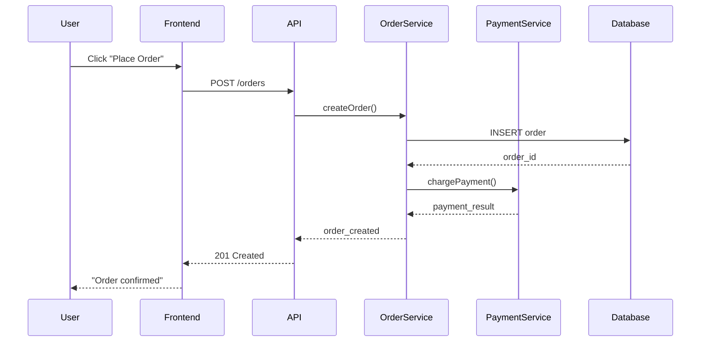
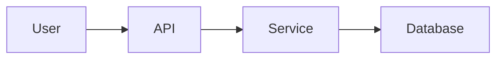

# Data Flow Mapping - Mid-Depth

At the surface level, you mapped where data comes from and where it goes. That's critical. But now you need to understand what happens to data along the way: transformations, validations, splits, merges, and the decisions that route data down different paths.

This matters because data bugs are usually transformation bugs. Someone converts a UTC timestamp to local time twice. A validation happens in the wrong order. A retry mechanism accidentally processes the same payment three times. These aren't syntax errors the compiler catches - they're logic errors that show up in production.

## 1. Mapping Transformations and Validations

Data rarely moves unchanged. It gets validated, transformed, enriched, filtered, aggregated, and reformatted. Each transformation is a potential failure point and a place where bugs hide.

### The Transformation Chain

Think of your data flow like a series of pipes. Each pipe section might filter, modify, or validate what passes through. You need to know:

1. What transformations happen where
2. What the data looks like at each stage
3. What validations apply at each boundary
4. What happens when validation fails

**E-commerce example: Order Creation Flow**

```
User Input (Frontend)
  ├─ Format: { items: [{sku, qty}], shipping: {...} }
  ├─ Validation: Required fields present, qty > 0
  └─ Transform: Add user_id from session

API Gateway
  ├─ Validation: JWT valid, rate limits not exceeded
  └─ Transform: None (pass-through)

Order Service
  ├─ Validation: SKUs exist, inventory available, shipping address valid
  ├─ Transform: Calculate totals, apply discounts
  ├─ Enrich: Fetch product details, validate promo codes
  └─ Output: { order_id, items: [{sku, qty, price}], totals: {...} }

Payment Service (async)
  ├─ Validation: Amount matches, payment method valid
  ├─ Transform: Convert to payment processor format
  └─ Side effect: Charge card, create transaction record

Fulfillment Queue (async)
  ├─ Transform: Group items by warehouse
  └─ Output: { warehouse_id, order_id, items: [...] }

Inventory Service (async)
  ├─ Transform: Convert to reservation format
  └─ Side effect: Decrement inventory counts
```

Notice how the data shape changes at each stage. The frontend works with simple objects. The order service enriches with pricing. Payment service reformats for Stripe. Fulfillment service reorganizes by warehouse.

### Validation Boundaries

Validation should happen at trust boundaries - places where data moves from less trusted to more trusted contexts:

**Client-side validation**: User experience only. Never trust this.

**API validation**: First real check. Validate schema, authentication, authorization.

**Service validation**: Business rules. "Can this user actually place this order?"

**Database validation**: Last line of defense. Constraints, foreign keys, check constraints.

Common mistake: Only validating at the API layer. If Service B calls Service C directly, Service C still needs to validate. Trust boundaries exist between services, not just between client and backend.

### Documenting Transformations

For each transformation step, document:

```markdown
### Step: Order Total Calculation

**Input**: Order object with items array
  - Each item has: sku, quantity, list_price

**Transformation Logic**:
1. Calculate subtotal: sum(item.list_price * item.quantity)
2. Apply discount codes (if any)
3. Calculate tax based on shipping address
4. Add shipping cost based on weight and destination

**Output**: Order with calculated fields
  - subtotal, discount_amount, tax_amount, shipping_cost, total

**Validation**:
- All prices must be positive
- Total must equal subtotal - discount + tax + shipping
- Tax rate must match state/province

**Error Handling**:
- Invalid discount code: Reject order, return 400 with error
- Tax calculation fails: Log error, use default rate, flag for review
- Negative total: Reject order, alert fraud team
```

This level of detail seems excessive until you're debugging why some orders have negative totals. Then you're glad someone wrote it down.

## 2. Synchronous vs Asynchronous Data Flows

Some data flows need immediate responses. Others can happen in the background. Getting this wrong creates either slow user experiences or data consistency problems.

### When to Use Synchronous Flow

Use synchronous (request-response) when:

1. **User is waiting**: Form submission, search, login
2. **Result needed immediately**: Balance check before purchase
3. **Atomic operation required**: Database transaction must complete or rollback
4. **Simple, fast operation**: < 200ms response time expected

**Example: Login Flow**

```
User submits credentials
  → API validates format
  → Auth service checks password
  → Session created
  → JWT returned
  ← User redirected to dashboard

Total time: 50-200ms
User cannot proceed without this completing
```

### When to Use Asynchronous Flow

Use asynchronous (queue, event, webhook) when:

1. **Long-running operation**: Video encoding, report generation, ML inference
2. **External dependency**: Email sending, third-party API calls
3. **Fan-out to multiple services**: Order placed triggers inventory, shipping, analytics
4. **Retry-able operation**: Can fail and be retried later without user intervention
5. **Not blocking user**: User doesn't need to wait for completion

**Example: Order Processing**

```
User places order
  → API validates immediately (sync)
  → Order record created (sync)
  ← User gets "Order received" confirmation (sync)

Background processing (async):
  → Payment processed (10s)
  → Inventory decremented (5s)
  → Shipping label created (30s)
  → Confirmation email sent (2s)
  → Analytics events published (1s)
  → Fraud check completed (60s)
```

User sees confirmation in 200ms. Everything else happens in background. If payment fails 10 seconds later, user gets an email. They're not staring at a loading spinner.

### The Hybrid Pattern

Real systems often mix both:

```
User uploads video
  → API validates file (sync)
  → Upload to S3 (sync, but streamed)
  → Create job record (sync)
  ← Return job_id to user (sync)

User sees upload progress, then "Processing" status

Background:
  → Transcode to multiple formats (async, 2-10 minutes)
  → Generate thumbnails (async, 30s)
  → Extract metadata (async, 10s)
  → Update job status → complete (async)
  → Send push notification (async)
```

Synchronous for the upload itself (user is waiting), asynchronous for processing (user can leave and come back).

### Async Flow Implementation Patterns

**Message Queue Pattern**:
```
Service A publishes to queue
  → Queue stores message durably
  → Service B consumes when ready
  → Service B acknowledges on completion
```

Good for: Work distribution, retry logic, decoupling services

**Event Stream Pattern**:
```
Service A publishes event
  → Event stream stores forever
  → Multiple services consume same event
  → Each service maintains own offset
```

Good for: Audit logs, event sourcing, multiple consumers

**Webhook Pattern**:
```
Service A calls Service B
  → Service B returns 202 Accepted immediately
  → Service B processes in background
  → Service B calls webhook URL when complete
```

Good for: Third-party integrations, long-running external operations

## 3. Designing for Idempotency

Idempotency means doing something multiple times has the same effect as doing it once. Networks fail. Retries happen. Users double-click submit buttons. Your data flows need to handle this.

### Why Idempotency Matters

Without idempotency:
- Retry charges card twice
- Duplicate order created
- User receives two confirmation emails
- Inventory decremented twice for one order

These aren't edge cases. They happen in production every day.

### Idempotent Operations

Some operations are naturally idempotent:

- **GET requests**: Reading data doesn't change state
- **PUT requests**: "Set user email to X" - same result every time
- **DELETE requests**: Deleting what's already deleted is a no-op

Others are not:

- **POST requests**: Creating new resources
- **PATCH requests**: Incrementing counters
- **Side effects**: Sending emails, charging cards, decrementing inventory

### Implementing Idempotency

**Pattern 1: Idempotency Keys**

Client generates unique key for operation:

```javascript
// Frontend generates key
const idempotencyKey = `order-${userId}-${timestamp}-${randomId}`;

fetch('/api/orders', {
  method: 'POST',
  headers: {
    'Idempotency-Key': idempotencyKey
  },
  body: JSON.stringify(orderData)
});
```

```python
# Backend tracks keys
def create_order(order_data, idempotency_key):
    # Check if we've seen this key before
    existing = db.query(IdempotencyRecord).filter_by(
        key=idempotency_key
    ).first()

    if existing:
        # Already processed - return cached result
        return existing.response, 200

    # Process order
    order = process_order(order_data)

    # Store key and response for future requests
    db.add(IdempotencyRecord(
        key=idempotency_key,
        response=order.to_json(),
        created_at=now()
    ))

    return order, 201
```

Stripe does this. If you retry a charge with the same idempotency key, you get the original charge result, not a new charge.

**Pattern 2: Natural Keys**

Use business logic to prevent duplicates:

```python
# Instead of auto-incrementing ID
order_id = f"ORD-{user_id}-{date}-{sequence}"

# Database unique constraint prevents duplicates
db.add(Order(
    id=order_id,
    user_id=user_id,
    # ...
))

try:
    db.commit()
except IntegrityError:
    # Order already exists - return existing
    return db.query(Order).get(order_id)
```

**Pattern 3: State Machines**

Track operation state to prevent re-execution:

```python
def charge_payment(order_id):
    order = db.query(Order).get(order_id)

    if order.payment_status == 'charged':
        # Already charged - idempotent no-op
        return order.payment_transaction

    if order.payment_status == 'processing':
        # Another worker is handling this
        raise ConflictError("Payment already processing")

    # Update state atomically
    order.payment_status = 'processing'
    db.commit()

    try:
        transaction = stripe.charge(order.amount)
        order.payment_status = 'charged'
        order.payment_transaction = transaction.id
        db.commit()
        return transaction
    except Exception as e:
        order.payment_status = 'failed'
        order.payment_error = str(e)
        db.commit()
        raise
```

The state machine prevents concurrent execution and records what happened.

### Where to Apply Idempotency

Apply at every external boundary:

1. **API endpoints**: Use idempotency keys
2. **Queue consumers**: Use message deduplication
3. **Webhook handlers**: Check if event already processed
4. **Database writes**: Use unique constraints and upserts
5. **External API calls**: Use provider's idempotency mechanism

Don't trust "this will only be called once" - it won't be.

## 4. Data Lineage and Audit Trails

Data lineage is the answer to "Where did this value come from?" Audit trails answer "Who changed this and when?" Both are critical for debugging, compliance, and trust.

### Why You Need Data Lineage

Problems lineage solves:

- Customer disputes charge amount: "How was this calculated?"
- Report shows unexpected metric: "Which data sources contributed?"
- Compliance audit: "Can you prove this PII was handled correctly?"
- Bug in production: "Which version of the pricing logic generated this?"

### Implementing Data Lineage

**Pattern 1: Lineage Metadata**

Attach provenance to data:

```json
{
  "order_id": "ORD-12345",
  "total": 142.50,
  "lineage": {
    "calculated_at": "2025-11-15T14:32:18Z",
    "calculation_version": "v2.3.1",
    "inputs": {
      "subtotal": {
        "value": 125.00,
        "source": "product_catalog_api",
        "fetched_at": "2025-11-15T14:32:15Z"
      },
      "tax_rate": {
        "value": 0.0875,
        "source": "tax_service",
        "jurisdiction": "NY",
        "fetched_at": "2025-11-15T14:32:16Z"
      },
      "shipping": {
        "value": 12.50,
        "source": "shipping_calculator",
        "method": "ground",
        "fetched_at": "2025-11-15T14:32:17Z"
      }
    }
  }
}
```

Detailed, but when you're debugging why some orders have wrong tax rates, you know exactly which service and which timestamp.

**Pattern 2: Event Sourcing**

Store every state change as an event:

```python
# Instead of storing current state
UPDATE orders SET status = 'shipped' WHERE id = 123

# Store the event that caused the change
INSERT INTO order_events (order_id, event_type, data, timestamp)
VALUES (123, 'order_shipped', '{"tracking": "ABC123"}', now())
```

Current state is derived from events. Complete history is preserved. You can replay events to see exactly how you got here.

**Pattern 3: Correlation IDs**

Track data flow across services:

```python
# API generates correlation ID
correlation_id = str(uuid.uuid4())

# Pass to all downstream services
order_service.create_order(data, correlation_id=correlation_id)
payment_service.charge(data, correlation_id=correlation_id)
email_service.send(data, correlation_id=correlation_id)

# Log everything with correlation ID
logger.info("Order created", extra={
    "correlation_id": correlation_id,
    "order_id": order.id
})
```

Now you can grep logs for one correlation ID and see the complete request flow across all services.

### Audit Trails for Compliance

Regulatory requirements (GDPR, HIPAA, SOX, PCI) often mandate audit trails. What you need:

**Who**: User ID, IP address, session ID
**What**: Action taken, data accessed or modified
**When**: Timestamp (with timezone)
**Where**: Which system, which endpoint
**Why**: Business reason (if applicable)
**Result**: Success or failure

Implementation:

```python
def audit_log(action, user_id, resource_type, resource_id,
              changes=None, ip_address=None):
    db.add(AuditLog(
        timestamp=datetime.utcnow(),
        user_id=user_id,
        action=action,  # 'created', 'updated', 'deleted', 'accessed'
        resource_type=resource_type,  # 'user', 'order', 'payment'
        resource_id=resource_id,
        changes=changes,  # Before/after values
        ip_address=ip_address,
        user_agent=request.user_agent.string
    ))
```

```python
# Usage
@app.route('/users/<user_id>', methods=['PUT'])
def update_user(user_id):
    old_user = db.query(User).get(user_id)
    new_data = request.json

    # Make changes
    old_user.email = new_data['email']

    # Log the change
    audit_log(
        action='updated',
        user_id=current_user.id,
        resource_type='user',
        resource_id=user_id,
        changes={
            'email': {
                'old': old_user.email,
                'new': new_data['email']
            }
        },
        ip_address=request.remote_addr
    )

    db.commit()
    return jsonify(old_user)
```

Audit logs are append-only. Never delete them. Never modify them. They're evidence.

### Retention and Performance

Lineage and audit data grows forever. Plan for it:

1. **Partition by time**: Monthly or yearly tables
2. **Archive old data**: Move to cheaper storage after 90 days
3. **Index appropriately**: By user_id, resource_id, timestamp
4. **Separate database**: Don't slow down production with audit queries

Healthcare system I worked on kept 7 years of audit logs for HIPAA. That's billions of records. They archived anything over 1 year old to S3, kept recent data in Postgres with partitioning by month.

## 5. Data Retention and Deletion Flows

GDPR gives users the "right to be forgotten". CCPA requires deletion within 45 days. Even without regulations, you probably don't need to keep everything forever. Plan deletion from day one.

### Retention Policies

Define retention for each data type:

```yaml
retention_policies:
  user_accounts:
    active: "indefinite"
    inactive_after: "3 years no login"
    delete_after_inactive: "1 year"

  order_history:
    keep: "7 years"  # Tax/financial requirements
    anonymize_after: "2 years"  # Remove PII, keep aggregates

  session_logs:
    keep: "90 days"
    delete_after: "90 days"

  audit_logs:
    keep: "7 years"  # Compliance
    cannot_delete: true

  support_tickets:
    keep: "2 years after resolution"
    anonymize_pii: true

  marketing_consent:
    keep: "indefinite while consent valid"
    delete_immediately_on_withdrawal: true
```

These aren't arbitrary - they're based on legal requirements, business needs, and user expectations.

### Implementing Right to Deletion

User requests deletion. Now what?

**Phase 1: Immediate Soft Delete**
```python
def initiate_user_deletion(user_id, request_source='user_request'):
    user = db.query(User).get(user_id)

    # Mark for deletion
    user.deletion_requested_at = datetime.utcnow()
    user.deletion_request_source = request_source
    user.status = 'pending_deletion'

    # Disable account immediately
    user.login_enabled = False

    # Log the request
    audit_log('deletion_requested', user_id, 'user', user_id)

    # Queue deletion job
    queue.publish('user_deletion', {
        'user_id': user_id,
        'requested_at': user.deletion_requested_at
    })

    db.commit()

    return {
        'message': 'Deletion scheduled',
        'completion_expected': '30 days'
    }
```

**Phase 2: Background Deletion Process**

```python
def process_user_deletion(user_id):
    """
    Delete user data across all systems.
    This might take hours for a user with years of activity.
    """

    # 1. Delete from primary database
    db.query(UserProfile).filter_by(user_id=user_id).delete()
    db.query(UserPreferences).filter_by(user_id=user_id).delete()

    # 2. Anonymize orders (keep for financial records)
    db.query(Order).filter_by(user_id=user_id).update({
        'user_email': '[deleted]',
        'shipping_name': '[deleted]',
        'shipping_address': '[deleted]'
    })

    # 3. Delete from external systems
    email_service.unsubscribe(user_id)
    crm_service.delete_contact(user_id)
    analytics_service.delete_user(user_id)

    # 4. Delete uploaded files
    s3.delete_prefix(f'user-uploads/{user_id}/')

    # 5. Delete from caches
    redis.delete(f'user:{user_id}:*')

    # 6. Remove from search indexes
    search_index.delete_user(user_id)

    # 7. Finally, delete user record
    user = db.query(User).get(user_id)
    user.status = 'deleted'
    user.deleted_at = datetime.utcnow()

    # Or hard delete
    db.query(User).filter_by(id=user_id).delete()

    db.commit()

    # 8. Audit the deletion
    audit_log('deletion_completed', None, 'user', user_id)
```

This is complex. You probably have data in 15 different places. You need to find it all.

### Data Deletion Mapping

Map everywhere user data lives:

```
User Data Locations:
├─ Primary Database
│  ├─ users table
│  ├─ user_profiles table
│  ├─ user_preferences table
│  └─ sessions table
│
├─ Orders Database
│  ├─ orders table (anonymize, don't delete)
│  └─ shipping_addresses table (delete)
│
├─ File Storage
│  ├─ S3: user-uploads/{user_id}/
│  └─ S3: profile-images/{user_id}.jpg
│
├─ External Services
│  ├─ Stripe: customer record
│  ├─ SendGrid: contact record
│  ├─ Segment: user profile
│  └─ Intercom: user conversations
│
├─ Caches
│  ├─ Redis: user:{user_id}:*
│  └─ CDN: cached API responses
│
├─ Search Indexes
│  ├─ Elasticsearch: user documents
│  └─ Typesense: user records
│
├─ Logs (cannot delete - anonymize)
│  ├─ Application logs (contains user_id)
│  └─ Access logs (contains IP addresses)
│
└─ Backups
   ├─ Database backups (note: contains deleted users)
   └─ File backups (note: contains deleted files)
```

Backups are tricky. You can't easily remove one user from a database backup. GDPR allows keeping backups as long as you don't restore them except for disaster recovery. Document this in your privacy policy.

### Cascading Deletes

Be careful with foreign key cascades:

```sql
-- This deletes orders when user deleted
CREATE TABLE orders (
    user_id INT REFERENCES users(id) ON DELETE CASCADE
);
```

That might be wrong. You might need to keep orders for financial/legal reasons. Instead:

```sql
-- This prevents deletion if orders exist
CREATE TABLE orders (
    user_id INT REFERENCES users(id) ON DELETE RESTRICT
);
```

Or better, handle in application:

```python
# Check for related data before deleting
orders = db.query(Order).filter_by(user_id=user_id).all()

for order in orders:
    # Anonymize instead of delete
    order.user_email = '[deleted]'
    order.shipping_name = '[deleted]'
    # Keep order_id, items, amounts for records

db.commit()
```

### Soft Delete vs Hard Delete

**Soft Delete**: Mark record as deleted, keep data
```python
user.deleted_at = datetime.utcnow()
user.status = 'deleted'
```

Pros: Can recover if mistake, preserves foreign key relationships
Cons: Doesn't actually delete data (GDPR problem), complicates queries

**Hard Delete**: Actually remove the record
```python
db.delete(user)
```

Pros: Actually gone, complies with deletion requests
Cons: Can break foreign key relationships, cannot recover

**Hybrid Approach**: Soft delete, then hard delete after grace period

```python
# Day 1: User requests deletion
user.status = 'pending_deletion'
user.deletion_requested_at = now()

# Day 30: Actually delete
if user.deletion_requested_at < (now() - 30 days):
    hard_delete_user(user.id)
```

Gives you recovery window while still complying with deletion requirements.

## 6. Cross-Service Data Flow Choreography

Microservices mean data flows across service boundaries. Who calls whom? What happens when services are down? How do you keep data consistent?

### Orchestration vs Choreography

**Orchestration**: Central controller tells everyone what to do

```python
def process_order(order_data):
    # Order Service orchestrates everything
    order = create_order_record(order_data)

    payment_result = payment_service.charge(order)
    if not payment_result.success:
        cancel_order(order.id)
        return error

    inventory_service.reserve_items(order.items)
    shipping_service.create_label(order)
    email_service.send_confirmation(order)

    return order
```

Pros: Easy to understand, clear flow, easy to debug
Cons: Tight coupling, orchestrator becomes bottleneck, fails if any service down

**Choreography**: Services react to events

```python
# Order Service
def create_order(order_data):
    order = save_order(order_data)
    publish_event('order.created', order)
    return order

# Payment Service listens for order.created
@event_handler('order.created')
def handle_order_created(order):
    result = charge_payment(order)
    publish_event('payment.processed', result)

# Inventory Service listens for payment.processed
@event_handler('payment.processed')
def handle_payment_processed(payment):
    if payment.success:
        reserve_inventory(payment.order_id)
        publish_event('inventory.reserved', ...)
```

Pros: Loose coupling, services independent, scales better
Cons: Harder to understand flow, harder to debug, eventual consistency

### When to Use Which

**Use orchestration when**:
- Flow is simple (3-4 steps)
- Need immediate consistency
- Clear single owner
- Transactional semantics required

**Use choreography when**:
- Complex flow (many steps)
- Services owned by different teams
- Need to add new behaviors without changing existing code
- Eventual consistency acceptable

Real systems use both. Tight loops use orchestration. Broad fan-out uses choreography.

### Handling Failures in Distributed Flows

Networks fail. Services go down. Databases deadlock. Your data flow needs to handle this.

**Pattern 1: Saga Pattern**

Break transaction into steps with compensating actions:

```python
# Happy path
steps = [
    ('create_order', 'cancel_order'),
    ('charge_payment', 'refund_payment'),
    ('reserve_inventory', 'release_inventory'),
    ('create_shipment', 'cancel_shipment')
]

executed = []

try:
    for action, compensation in steps:
        result = execute(action)
        executed.append((compensation, result))

except Exception as e:
    # Rollback in reverse order
    for compensation, result in reversed(executed):
        execute(compensation, result)
    raise
```

Each step has a compensating action. If step 3 fails, you undo steps 2 and 1.

**Pattern 2: Retry with Idempotency**

Most failures are transient. Retry.

```python
@retry(
    max_attempts=3,
    backoff=exponential,
    exceptions=[NetworkError, TimeoutError]
)
def call_payment_service(order):
    return payment_service.charge(
        amount=order.total,
        idempotency_key=order.payment_idempotency_key
    )
```

Idempotency key prevents charging twice if first call succeeded but response was lost.

**Pattern 3: Dead Letter Queues**

If retries fail, don't lose the message:

```python
# Normal queue
queue.publish('order.process', order_data)

# Consumer
try:
    process_order(message)
    message.ack()
except RetryableError:
    message.nack(requeue=True)  # Try again
except FatalError:
    message.nack(requeue=False)  # Send to DLQ
    dlq.publish('order.process.failed', {
        'original_message': message,
        'error': str(error),
        'timestamp': now()
    })
```

Dead letter queue holds messages that can't be processed. You can inspect them, fix issues, replay them manually.

### Data Consistency Across Services

Each service has its own database (microservices best practice). How do you keep them consistent?

**Eventual Consistency**

Accept that data will be inconsistent for a short time:

```
T=0: User places order in Order Service
T=1: Order Service publishes order.created event
T=2: Inventory Service receives event, decrements stock
T=3: Analytics Service receives event, updates metrics

For 3 seconds, inventory and analytics are stale.
That's usually okay.
```

**When Eventual Consistency Isn't Enough**

Some operations need strong consistency:

- Preventing double-spending in financial transactions
- Ensuring seat booking doesn't oversell
- Enforcing unique usernames

Solutions:

1. **Use distributed transaction coordinator** (XA transactions, 2-phase commit)
   - Slow, complex, often not worth it

2. **Keep related data in same service**
   - Users and authentication in one service
   - Orders and inventory in one service
   - Violates service boundaries but solves consistency

3. **Use saga pattern** (described above)
   - Eventual consistency with compensating actions
   - More work but more reliable

4. **Pessimistic locking**
   - Lock the resource before distributed operation
   - Release after all services updated
   - Can cause deadlocks, use carefully

No perfect answer. Choose based on consistency requirements and complexity tolerance.

## 7. Data Validation Boundaries

Validate early, validate often, but know what you're validating at each layer.

### The Validation Hierarchy

**Client-side (JavaScript)**:
- Purpose: User experience
- Examples: Email format, required fields, character limits
- Trust level: Zero (user controls this code)

```javascript
// Good for UX, useless for security
if (!email.includes('@')) {
    showError("Invalid email");
}
```

**API Gateway**:
- Purpose: Protect backend from malformed requests
- Examples: Authentication, rate limiting, schema validation
- Trust level: Moderate (you control it, but haven't checked business rules)

```python
# Schema validation
schema = {
    "email": {"type": "string", "required": True},
    "age": {"type": "integer", "minimum": 0}
}

if not validate(request.json, schema):
    return {"error": "Invalid request"}, 400
```

**Service Layer**:
- Purpose: Business logic validation
- Examples: "Does this user have permission?", "Is this product in stock?"
- Trust level: High (this is your actual validation)

```python
def create_order(user_id, items):
    user = get_user(user_id)

    if not user.can_place_orders():
        raise PermissionError("Account suspended")

    for item in items:
        if not inventory.is_available(item.sku, item.quantity):
            raise ValidationError(f"{item.sku} out of stock")

    # Business rules passed, create order
```

**Database Layer**:
- Purpose: Last line of defense, data integrity
- Examples: Foreign keys, unique constraints, check constraints
- Trust level: Absolute (database enforces this)

```sql
CREATE TABLE orders (
    id INT PRIMARY KEY,
    user_id INT NOT NULL REFERENCES users(id),
    total DECIMAL(10,2) CHECK (total >= 0),
    created_at TIMESTAMP DEFAULT CURRENT_TIMESTAMP
);
```

### Defense in Depth

Validate at every layer. Don't assume prior layers validated correctly.

```python
# API endpoint
@app.route('/orders', methods=['POST'])
def create_order_endpoint():
    # Layer 1: Schema validation
    if not validate_schema(request.json):
        return error(400, "Invalid request format")

    # Layer 2: Authentication
    user = get_current_user()
    if not user:
        return error(401, "Unauthorized")

    # Layer 3: Service layer (business rules)
    try:
        order = order_service.create_order(
            user_id=user.id,
            items=request.json['items']
        )
    except ValidationError as e:
        return error(400, str(e))

    return jsonify(order), 201


# Service layer
def create_order(user_id, items):
    # Don't trust that API validated - check again
    if not items:
        raise ValidationError("Order must have items")

    # Business validation
    user = user_service.get_user(user_id)
    if not user.active:
        raise ValidationError("User account inactive")

    # Check inventory
    for item in items:
        if not inventory_service.check_stock(item['sku'], item['qty']):
            raise ValidationError(f"{item['sku']} insufficient stock")

    # Create in database (final validation via constraints)
    order = Order(user_id=user_id, items=items)
    db.add(order)
    db.commit()  # Database constraints checked here

    return order
```

Seems redundant. It is. That's the point. When one layer fails, others catch it.

### What to Validate Where

**Client-side**: Everything for UX, nothing for security
- Field formats
- Required fields
- Character limits
- Client-side business rules (show/hide based on selections)

**API Gateway**: Request structure and authentication
- Schema compliance
- JWT validation
- Rate limits
- Request size limits

**Service Layer**: All business rules
- Authorization (can this user do this?)
- Business constraints (is this action allowed?)
- Data availability (does referenced data exist?)
- State transitions (can order move from pending to shipped?)

**Database**: Data integrity
- Foreign key constraints
- Unique constraints
- Check constraints (value ranges, formats)
- Not null constraints

### Common Validation Mistakes

**Mistake 1: Only validating in client**
```javascript
// Frontend only
if (age < 18) {
    alert("Must be 18+");
    return;
}
```
Anyone can bypass this with browser dev tools.

**Mistake 2: Trusting internal services**
```python
# Service A trusts Service B validated
def process_payment(order_id):
    # Assumes order_id is valid because Service B sent it
    order = db.get(order_id)
    charge_card(order.amount)  # What if order is None?
```

**Mistake 3: Inconsistent validation**
```python
# API allows 200 char description
schema = {"description": {"maxLength": 200}}

# Database allows 100
CREATE TABLE products (
    description VARCHAR(100)
);
```
API accepts data that database rejects. Validation rules must match.

**Mistake 4: Not validating on updates**
```python
# Validates on create
def create_user(data):
    validate_user(data)
    db.add(User(**data))

# Doesn't validate on update
def update_user(user_id, data):
    db.query(User).filter_by(id=user_id).update(data)
```
User could update to invalid state.

## 8. Handling PII and Sensitive Data Flows

Personally Identifiable Information (PII) and sensitive data require special handling. Credit cards, social security numbers, health data, passwords - these have different rules than regular data.

### Identifying Sensitive Data

What counts as sensitive:

**PII (GDPR, CCPA)**:
- Name, email, phone, address
- IP address, device ID, cookie IDs
- Biometric data, photos
- Any data that identifies a person

**Payment Card Industry (PCI-DSS)**:
- Credit card numbers
- CVV codes
- Card expiration dates

**Protected Health Information (HIPAA)**:
- Medical records
- Treatment history
- Insurance information
- Any health data linked to a person

**Authentication Secrets**:
- Passwords (even hashed)
- API keys, tokens
- Security questions/answers

### Minimizing Sensitive Data Flow

Best defense: Don't store it.

**Pattern 1: Tokenization**

Replace sensitive data with non-sensitive token:

```python
# Don't store card number
card_number = "4532123456789012"

# Instead, tokenize it
token = stripe.create_token(card_number)
# Returns: "tok_abc123xyz"

# Store only token
user.payment_token = token
db.commit()

# Later, charge using token
stripe.charge(amount=1000, source=user.payment_token)
```

Stripe (or Braintree, Adyen) stores the card. You store a meaningless token. Your database never has card numbers. Massively reduces PCI compliance scope.

**Pattern 2: Hashing**

One-way transformation for data you need to verify but not retrieve:

```python
# Never store plaintext passwords
password = request.json['password']

# Hash it
hashed = bcrypt.hashpw(password.encode(), bcrypt.gensalt())

# Store hash only
user.password_hash = hashed
db.commit()

# Later, verify without storing original
def verify_password(user, password_attempt):
    return bcrypt.checkpw(
        password_attempt.encode(),
        user.password_hash
    )
```

You can verify the password is correct without storing the password. Can't reverse the hash to get password back.

### Encrypting Sensitive Data

When you must store sensitive data, encrypt it.

**Encryption at Rest**: Encrypt database/disk

```python
# Application-level encryption
from cryptography.fernet import Fernet

# Generate key (store securely, not in code!)
key = Fernet.generate_key()
cipher = Fernet(key)

# Encrypt before storing
ssn = "123-45-6789"
encrypted_ssn = cipher.encrypt(ssn.encode())
user.ssn_encrypted = encrypted_ssn

# Decrypt when needed
decrypted = cipher.decrypt(user.ssn_encrypted).decode()
```

**Encryption in Transit**: Use TLS/HTTPS

```python
# All API calls over HTTPS
api.get('https://api.example.com/users')  # Encrypted

# Never send sensitive data unencrypted
api.get('http://api.example.com/users')   # DON'T DO THIS
```

**Field-level Encryption**: Encrypt specific columns

```python
# Some fields encrypted, some not
class User:
    id = Column(Integer)  # Not encrypted
    email = Column(String)  # Not encrypted (need to query on it)
    ssn = Column(EncryptedString)  # Encrypted
    medical_history = Column(EncryptedText)  # Encrypted
```

Trade-off: Can't query on encrypted fields. Can't do `WHERE ssn = '123-45-6789'` if SSN is encrypted with different keys.

### Sensitive Data in Logs

Common mistake: Logging sensitive data

```python
# BAD: Logs password
logger.info(f"User login: {username}, password: {password}")

# BAD: Logs full credit card
logger.error(f"Payment failed for card {card_number}")

# BAD: Logs user data that includes SSN
logger.debug(f"User data: {user.__dict__}")
```

**Solution: Redact sensitive fields**

```python
def redact_sensitive(data):
    """Remove sensitive fields from log data"""
    sensitive_fields = ['password', 'ssn', 'card_number', 'cvv']

    if isinstance(data, dict):
        return {
            k: '[REDACTED]' if k in sensitive_fields else v
            for k, v in data.items()
        }
    return data

# Safe logging
logger.info(f"User data: {redact_sensitive(user.__dict__)}")
```

### Data Masking

Show only what's needed:

```python
def mask_card_number(card):
    # Show last 4 digits only
    return f"****-****-****-{card[-4:]}"

def mask_ssn(ssn):
    # Show last 4 digits
    return f"***-**-{ssn[-4:]}"

def mask_email(email):
    # Show first char and domain
    username, domain = email.split('@')
    return f"{username[0]}***@{domain}"
```

```python
# API response
{
    "user": {
        "name": "John Doe",
        "email": "j***@example.com",
        "card": "****-****-****-1234"
    }
}
```

Enough to identify ("Is this the card ending in 1234?") but not enough to steal.

### Sensitive Data Across Boundaries

**Don't pass PII through analytics**

```javascript
// BAD: Sends email to Google Analytics
analytics.track('User Registered', {
    email: user.email,
    name: user.name
});

// GOOD: Sends anonymous ID only
analytics.track('User Registered', {
    user_id: user.id,  // Internal ID, not PII
    timestamp: Date.now()
});
```

**Don't include PII in URLs**

```python
# BAD: SSN in URL (appears in logs, browser history)
@app.route('/users/<ssn>/profile')

# GOOD: Use opaque ID
@app.route('/users/<user_id>/profile')
```

**Be careful with third-party services**

```python
# Before sending data to third party
def send_to_crm(user):
    # Check: Does CRM need SSN? Probably not.
    safe_data = {
        'email': user.email,
        'name': user.name,
        # Don't send: SSN, medical_history, card_number
    }
    crm_service.create_contact(safe_data)
```

Every third-party service you share data with is a liability. They get breached, your users' data leaks. Only share what's necessary.

## 9. Data Flow Documentation Tools

Data flow maps are useless if only in your head. Document them.

### Sequence Diagrams

Show request-response flows between components:



Good for: Synchronous flows, showing timing, request-response patterns

### Data Flow Diagrams

Show how data moves and transforms:

```
[User Input]
    |
    v
[Client Validation] --> (Valid) --> [API Gateway]
    |                                     |
    v                                     v
(Invalid)                          [Auth Service]
    |                                     |
    v                                     v
[Error Response]                   [Order Service]
                                        |
                    +-------------------+-------------------+
                    v                   v                   v
            [Payment Service]   [Inventory Service]   [Email Service]
                    |                   |                   |
                    v                   v                   v
            [Payment Gateway]      [Database]          [SendGrid]
```

Good for: High-level flow, showing branches and parallel processing

### State Machines

Show data state transitions:

```
Order States:
    [Created] --> (payment_succeeded) --> [Paid]
    [Created] --> (payment_failed) --> [Cancelled]
    [Paid] --> (items_picked) --> [Preparing]
    [Preparing] --> (label_created) --> [Shipped]
    [Shipped] --> (delivered) --> [Completed]
    [Any State] --> (user_cancelled) --> [Cancelled]
```

Good for: Understanding valid state transitions, preventing invalid states

### Architecture Diagrams

Show system components and data stores:

```
┌─────────────┐
│   Frontend  │
└──────┬──────┘
       │
       v
┌─────────────┐      ┌──────────────┐
│ API Gateway │─────>│ Auth Service │
└──────┬──────┘      └──────────────┘
       │
       v
┌─────────────┐      ┌──────────────┐
│Order Service│─────>│   Database   │
└──────┬──────┘      └──────────────┘
       │
       │
   ┌───┴────┬────────────┐
   v        v            v
┌────────┐ ┌─────────┐ ┌──────┐
│Payment │ │Inventory│ │Email │
│Service │ │ Service │ │Queue │
└────────┘ └─────────┘ └──────┘
```

Good for: Understanding system structure, service dependencies

### Documentation Tools

**Mermaid**: Text-based diagrams in Markdown
```markdown

```

Renders in GitHub, GitLab, many documentation tools.

**PlantUML**: More detailed UML diagrams
```
@startuml
User -> Frontend: Place order
Frontend -> API: POST /orders
API -> OrderService: createOrder()
OrderService -> Database: Save order
@enduml
```

**Draw.io / Excalidraw**: Visual diagramming tools
- Draw.io: Professional, feature-rich
- Excalidraw: Simple, hand-drawn style

**Code as Documentation**: Extract from actual code
```python
# Generate diagram from code
from dataflow import Diagram

diagram = Diagram()
diagram.add_flow('User', 'API', 'POST /orders')
diagram.add_flow('API', 'OrderService', 'createOrder()')
diagram.add_flow('OrderService', 'Database', 'INSERT order')
diagram.render('order_flow.png')
```

Best approach: Diagrams in version control alongside code. When code changes, diagrams should too.

## 10. Common Pitfalls

Things that go wrong with data flows, repeatedly, across every project.

### Missing Validation

**Problem**: Assuming data is valid because it came from an internal service

```python
# Service A
def create_order(user_id, items):
    # Validates items
    for item in items:
        assert item['quantity'] > 0

    # Publishes to queue
    queue.publish('order.created', {
        'user_id': user_id,
        'items': items
    })

# Service B - assumes data is valid
def process_order(message):
    order_data = message['data']
    # Doesn't check if items exist!
    # Doesn't check quantities!
    # Crashes if data malformed
    charge_payment(order_data)
```

**Solution**: Validate at every boundary
```python
def process_order(message):
    order_data = message['data']

    # Validate even though Service A should have
    if not order_data.get('items'):
        raise ValidationError("No items in order")

    for item in order_data['items']:
        if item['quantity'] <= 0:
            raise ValidationError("Invalid quantity")

    charge_payment(order_data)
```

### Data Loss During Transformations

**Problem**: Losing data when converting between formats

```python
# API receives
{
    "amount": 10.99,
    "currency": "USD",
    "metadata": {"order_id": "123", "source": "web"}
}

# Service stores
db.add(Payment(
    amount=data['amount'],
    currency=data['currency']
    # Lost: metadata
))
```

Later you need to trace payment back to order, but you didn't store the metadata.

**Solution**: Map all fields explicitly
```python
db.add(Payment(
    amount=data['amount'],
    currency=data['currency'],
    metadata=data.get('metadata', {}),  # Explicitly include
    raw_request=json.dumps(data)  # Or store entire request
))
```

### Race Conditions in Data Updates

**Problem**: Multiple processes updating same data

```python
# Request 1: Update inventory
quantity = db.get_quantity(sku)  # reads: 10
quantity = quantity - 5           # calculates: 5
db.set_quantity(sku, quantity)    # writes: 5

# Request 2: Update inventory (concurrent)
quantity = db.get_quantity(sku)  # reads: 10 (before Request 1 writes)
quantity = quantity - 3           # calculates: 7
db.set_quantity(sku, quantity)    # writes: 7

# Final result: 7 (should be 2)
# Lost update from Request 1
```

**Solution**: Use atomic operations
```python
# Atomic decrement
db.execute(
    "UPDATE inventory SET quantity = quantity - :amount WHERE sku = :sku",
    {"amount": 5, "sku": sku}
)
```

Or optimistic locking:
```python
# Read with version
product = db.query(Product).get(sku)
original_version = product.version

# Update with version check
result = db.execute(
    """UPDATE products
       SET quantity = :new_qty, version = version + 1
       WHERE sku = :sku AND version = :version""",
    {
        "new_qty": product.quantity - 5,
        "sku": sku,
        "version": original_version
    }
)

if result.rowcount == 0:
    raise ConcurrentUpdateError("Product was updated by another process")
```

### Not Handling Partial Failures

**Problem**: Operation partially succeeds, leaves system in inconsistent state

```python
def create_order(order_data):
    # Step 1: Create order - succeeds
    order = db.add(Order(**order_data))
    db.commit()

    # Step 2: Charge payment - fails
    payment = charge_card(order.total)
    # Exception raised, function exits

    # Step 3: Never reached
    inventory.decrement(order.items)

    # Result: Order created but not paid, inventory not decremented
```

**Solution**: Track state and use compensating actions
```python
def create_order(order_data):
    order = None
    payment = None

    try:
        # Step 1
        order = db.add(Order(**order_data, status='pending'))
        db.commit()

        # Step 2
        payment = charge_card(order.total)

        # Step 3
        inventory.decrement(order.items)

        # Success
        order.status = 'confirmed'
        db.commit()

    except PaymentError as e:
        # Rollback: Cancel order
        if order:
            order.status = 'payment_failed'
            db.commit()
        raise

    except InventoryError as e:
        # Rollback: Refund payment, cancel order
        if payment:
            refund_card(payment.id)
        if order:
            order.status = 'inventory_unavailable'
            db.commit()
        raise
```

### Unbounded Data Growth

**Problem**: Not planning for data volume

```python
# Works fine with 100 users
users = db.query(User).all()
for user in users:
    send_notification(user)

# Breaks with 1,000,000 users
# Loads entire table into memory, crashes
```

**Solution**: Pagination and batching
```python
page_size = 100
offset = 0

while True:
    users = db.query(User).limit(page_size).offset(offset).all()

    if not users:
        break

    for user in users:
        send_notification(user)

    offset += page_size
```

Or use cursor-based pagination:
```python
last_id = 0

while True:
    users = db.query(User).filter(User.id > last_id).limit(100).all()

    if not users:
        break

    for user in users:
        send_notification(user)

    last_id = users[-1].id
```

### Not Validating External API Responses

**Problem**: Trusting third-party APIs always return expected format

```python
# Assumes Stripe always returns this structure
response = stripe.charge(amount=1000)
transaction_id = response['id']  # KeyError if format changes
status = response['status']      # KeyError if format changes
```

**Solution**: Validate external responses
```python
response = stripe.charge(amount=1000)

if not isinstance(response, dict):
    raise IntegrationError("Unexpected response format from Stripe")

if 'id' not in response:
    logger.error(f"Stripe response missing id: {response}")
    raise IntegrationError("Payment provider response invalid")

transaction_id = response['id']
status = response.get('status', 'unknown')
```

### Storing Timestamps Without Timezone

**Problem**: Ambiguous times

```python
# Stores: 2025-11-15 14:30:00
# Is that UTC? Local time? User's timezone?
order.created_at = datetime.now()
```

Six months later, trying to debug: "Did this order happen before or after the server restart at 2pm?" Can't tell. Server is in US Eastern, user is in Japan, database is in UTC.

**Solution**: Always use UTC, always store timezone
```python
from datetime import datetime, timezone

# Store UTC
order.created_at = datetime.now(timezone.utc)

# Or use timezone-aware datetime
order.created_at = datetime.now(timezone.utc)
```

Display in user's local timezone in frontend, but store in UTC.

---

## Summary

Data flow mapping at mid-depth is about:

1. **Transformations**: Map what happens to data at each stage
2. **Sync vs Async**: Choose based on user needs and consistency requirements
3. **Idempotency**: Make operations safe to retry
4. **Lineage**: Track where data came from and what happened to it
5. **Retention**: Plan deletion from day one
6. **Cross-service**: Handle distributed flows with sagas and events
7. **Validation**: Validate at every boundary, not just once
8. **Sensitive data**: Minimize, encrypt, tokenize, mask
9. **Documentation**: Diagrams in version control
10. **Pitfalls**: Learn from common mistakes

The goal isn't perfect data flow. It's data flow you can understand, debug, and modify when requirements change. Which they will.

Next level: Deep-water covers event sourcing, CQRS, distributed tracing, complex compliance scenarios, and data mesh architectures.
---

## Navigation

### Depth Levels
- **[← Surface](../surface/index.md)** Essential concepts and quick start
- **[Deep Water →](../deep-water/index.md)** Advanced architectures and enterprise patterns

### Related Topics
- [Architecture Design](../../architecture-design/mid-depth/index.md) - Related design considerations
- [Database Design](../../database-design/mid-depth/index.md) - Related design considerations
- [State Management Design](../../state-management-design/mid-depth/index.md) - Related design considerations

### Navigate
- [← Back to Design Phase](../../index.md)
- [↑ Back to Main Guide](../../../../README.md)
